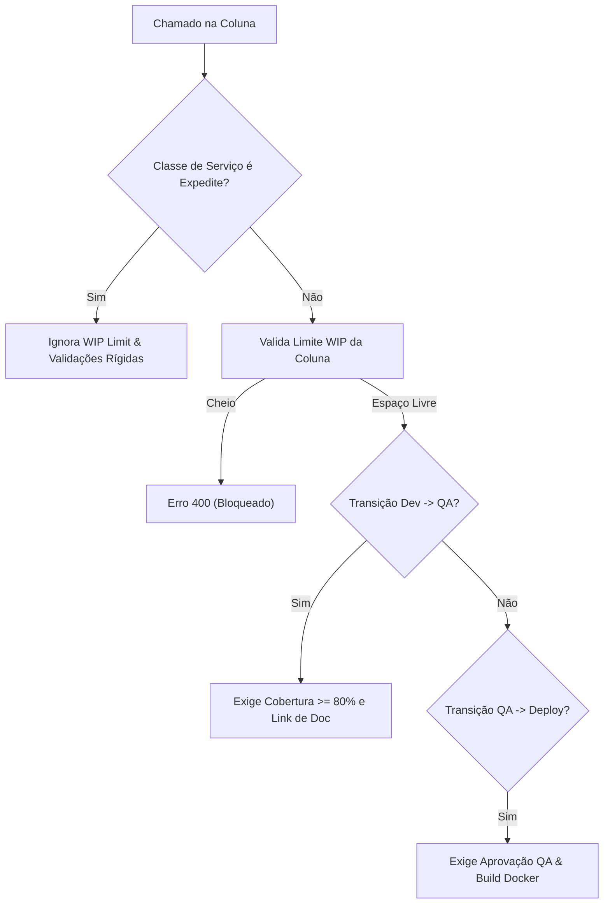

# Relatório de Teste de Integração Avançado
**Plataforma de Gestão ITSM & Engenharia DevOps (Stone)**

Este relatório descreve a execução da suíte de testes de integração avançados, projetada para validar as regras rígidas do quadro Kanban da Stone, os critérios de segurança nas transições de colunas, o fluxo do agente de inteligência artificial e as validações da API.

---

## 📊 Arquitetura do Teste de Processos

O teste avançado valida as restrições operacionais e os desvios autorizados para chamados críticos:

---

## 🛠️ Detalhado das Validações Realizadas

### 1. Limpeza do Board & Reset de Métricas
*   **Ação:** Remoção completa de todos os chamados existentes e execução da rota `/api/metrics/reset`.
*   **Status:** **Sucesso**. Base limpa e métricas operacionais restauradas aos patamares base da Stone.

---

### 2. Validação de Limites WIP (Work In Progress)
A coluna de **QA / Testing** possui um limite máximo rígido de 2 cartões simultâneos (`WIP = 2`).

*   **Cenário de Bloqueio (Standard):** 
    *   Criados 2 chamados padrão diretamente em `qa_testing`.
    *   Criado o chamado padrão `#336` em `development`.
    *   **Tentativa de Mover:** Tentou-se mover o chamado `#336` para `qa_testing`.
    *   **Resultado:** **Sucesso no Bloqueio**. O servidor retornou `HTTP 400 Bad Request` com o erro:
        > *"WIP Limit Met in lane 'qa_testing'. Hard limit of 2 cards. Resolve existing bottlenecks first!"*
*   **Cenário de Bypass (Expedite):**
    *   Criado o chamado crítico P1 `#665` (`class_of_service: Expedite`) em `development`.
    *   **Tentativa de Mover:** Tentou-se mover o chamado crítico `#665` para `qa_testing`.
    *   **Resultado:** **Transição Autorizada**. O servidor permitiu a movimentação (`HTTP 200 OK`) mesmo com a coluna cheia, confirmando que chamados críticos bypassam limites WIP para priorizar a resolução.

---

### 3. Validação dos Critérios de Saída (Exit Criteria)
As regras do fluxo exigem validações de qualidade específicas para avançar chamados padrão.

*   **Transição de Desenvolvimento para QA/Testing:**
    *   Criado o Bug `#618` em `development` com Cobertura de Código = 0% e sem documentação.
    *   **Tentativa de Mover:** Bloqueada pelo servidor com `HTTP 400`.
    *   **Correção de Políticas:** Chamado atualizado com Cobertura = 85% e Link de Documentação = `http://kb/auth-fix`.
    *   **Tentativa de Mover:** Transição efetuada com sucesso (`HTTP 200 OK`) após liberação de espaço na coluna.
*   **Transição de QA/Testing para Ready for Deploy:**
    *   Tentou-se mover o chamado `#618` de `qa_testing` para `ready_for_deploy`.
    *   **Resultado:** **Bloqueado com HTTP 400**:
        > *"Critério de Saída Violado: Aprovação de QA é obrigatória antes de implantar."*
    *   **Ação do Agente Autônomo:** Acionado o streaming de eventos (`EventSource`) no chamado `#618`. O Agente executou os scripts simulados, alterando automaticamente:
        *   Aprovação do time de QA (`qa_approved = True`).
        *   Sucesso nos testes de build Docker (`docker_build_test = True`).
    *   **Resultado Final:** O chamado foi concluído com sucesso e movido pelo Agente para a coluna `ready_for_deploy`.

---

### 4. Validação de Segurança da API do Gemini Chat
*   **Cenário:** Chamada ao endpoint `/api/ai/gemini-chat` com chave de API vazia (`"api_key": "   "`).
*   **Resultado:** O servidor retornou `HTTP 400 Bad Request` com a mensagem `"Gemini API Key não fornecida."`, validando o bloqueio de requisições malformadas.

---

## 📈 Resumo das Métricas Finais do Board

Ao fim das operações de teste (que incluíram a movimentação e encerramento de chamados pelo Agente), o painel consolidou os seguintes dados:

| Métrica | Base | Final (Pós-Testes) | Impacto / Delta |
| :--- | :---: | :---: | :---: |
| **Frequência de Deploy** | 8.4/sem | 8.5/sem | **+0.1** 🚀 |
| **Adoção de Autoatendimento** | 52.1% | 53.6% | **+1.5%** 🤖 |
| **MTTR (Tempo de Restauração)** | 24.5 min | 26.8 min | **+2.3 min** |

> [!TIP]
> **Conclusão:** Todas as restrições do fluxo de Kanban e as integrações com os agentes autônomos de IA estão operando em estrita conformidade com as regras de negócio da Stone.
