# Relatório de Teste de Integração Avançado
**Plataforma de Gestão ITSM & Engenharia DevOps (Stone) com SQLite**

Este relatório descreve a execução e validação da suíte de testes de integração automatizada (`test_integration.py`), projetada para validar as regras rígidas do quadro Kanban da Stone, os critérios de segurança nas transições de colunas, a persistência no banco SQLite (`stone.db`), o fluxo do agente de inteligência artificial via Server-Sent Events (SSE), e as novas rotas de histórico de chat da IA.

---

## 📊 Arquitetura do Teste de Processos

O script de teste executa um fluxo de integração fim-a-fim contra o servidor backend ativo, validando as restrições operacionais e os desvios autorizados para chamados críticos:

```mermaid
graph TD
    A["Chamado na Coluna"] --> B{"Classe de Serviço é Expedite?"}
    B -- Sim --> C["Ignora WIP Limit & Validações Rígidas"]
    B -- Não --> D["Valida Limite WIP da Coluna"]
    D -- Cheio --> E["Erro 400 (Bloqueado)"]
    D -- Espaço Livre --> F{"Transição Dev -> QA?"}
    F -- Sim --> G["Exige Cobertura >= 80% e Link de Doc"]
    F -- Não --> H{"Transição QA -> Deploy?"}
    H -- Sim --> I["Exige Aprovação QA & Build Docker"]
```

---

## 🛠� Detalhado das Validações Realizadas (Automação `test_integration.py`)

### 1. Limpeza do Board & Reset de Métricas
*   **Ação:** Execução da rota `/api/metrics/reset` e deleção em lote (`DELETE /api/tickets/{id}`) de todos os tickets persistidos no banco.
*   **Status:** **PASSO [✅]**. Base SQLite totalmente limpa e métricas operacionais restauradas aos patamares base da Stone.

---

### 2. Validação de Limites WIP (Work In Progress)
A coluna de **QA / Testing** possui um limite máximo rígido de 2 cartões simultâneos (`WIP = 2`).

*   **Cenário de Bloqueio (Standard):** 
    *   Criados 2 chamados padrão diretamente em `qa_testing` para encher a coluna.
    *   Criado o chamado padrão em `development`.
    *   **Tentativa de Mover:** Tentou-se mover o chamado padrão para `qa_testing`.
    *   **Resultado:** **PASSO [✅] (Bloqueado)**. O servidor retornou `HTTP 400 Bad Request` com o erro:
        > *"WIP Limit Met in lane 'qa_testing'. Hard limit of 2 cards. Resolve existing bottlenecks first!"*
*   **Cenário de Bypass (Expedite):**
    *   Criado o chamado crítico P1 (`class_of_service: Expedite`) em `development`.
    *   **Tentativa de Mover:** Tentou-se mover o chamado crítico para `qa_testing`.
    *   **Resultado:** **PASSO [✅] (Transição Autorizada)**. O servidor permitiu a movimentação (`HTTP 200 OK`) mesmo com a coluna cheia, confirmando que chamados críticos bypassam limites WIP para priorizar a resolução.

---

### 3. Validação dos Critérios de Saída (Exit Criteria)
As regras do fluxo exigem validações de qualidade específicas para avançar chamados padrão.

*   **Transição de Desenvolvimento para QA/Testing:**
    *   Criado um Bug em `development` com Cobertura de Código = 0% e sem documentação.
    *   **Tentativa de Mover:** Bloqueada pelo servidor com `HTTP 400` ("Critério de Saída Violado").
    *   **Correção de Políticas:** Chamado atualizado com Cobertura = 90% e Link de Documentação = `http://kb/conciliacao`.
    *   **Tentativa de Mover:** Transição efetuada com sucesso (`HTTP 200 OK`) após liberar espaço na coluna.
*   **Transição de QA/Testing para Ready for Deploy:**
    *   Tentou-se mover o Bug de `qa_testing` para `ready_for_deploy`.
    *   **Resultado:** **PASSO [✅] (Bloqueado com HTTP 400)**:
        > *"Critério de Saída Violado: Aprovação de QA é obrigatória antes de implantar."*
    *   **Ação do Agente Autônomo:** Acionado o streaming de eventos (`EventSource`) no chamado. O Agente executou os scripts simulados, alterando automaticamente:
        *   Aprovação do time de QA (`qa_approved = True`).
        *   Sucesso nos testes de build Docker (`docker_build_test = True`).
    *   **Resultado Final:** O chamado foi concluído com sucesso e movido pelo Agente para a coluna `ready_for_deploy`.

---

### 4. Validação de Segurança da API do Gemini Chat
*   **Cenário:** Chamada ao endpoint `/api/ai/gemini-chat` com chave de API vazia (`"api_key": "   "`).
*   **Resultado:** **PASSO [✅]**. O servidor retornou `HTTP 400 Bad Request` com a mensagem `"Gemini API Key não fornecida."`, validando o bloqueio de requisições malformadas.

---

### 5. Histórico de Chat e Persistência no SQLite
*   **Ação:** Chamada para limpar histórico (`DELETE /api/ai/chat-history`), verificação de histórico vazio, simulação de chamados no banco.
*   **Resultado:** **PASSO [✅]**. O histórico de conversas é salvo de forma estruturada na tabela `chat_conversations` do SQLite e foi limpo e consultado com sucesso.

---

## 📈 Resumo das Métricas Finais do Board (Execução Automatizada)

| Métrica | Base | Final (Pós-Testes) | Impacto / Delta | Status |
| :--- | :---: | :---: | :---: | :---: |
| **Frequência de Deploy** | 8.4/sem | 8.5/sem | **+0.1** 🚀 | **PASSO [✅]** |
| **Adoção de Autoatendimento** | 52.1% | 53.6% | **+1.5%** 🤖 | **PASSO [✅]** |
| **MTTR (Tempo de Restauração)** | 24.5 min | 26.8 min | **+2.3 min** | **PASSO [✅]** |

> [!TIP]
> **Conclusão Geral:** Todas as restrições do fluxo de Kanban, persistência SQLite no arquivo `stone.db`, integrações com os agentes autônomos de IA e as rotas de histórico estão operando em **100% de conformidade** com os requisitos de FinOps & ITSM da Stone.
